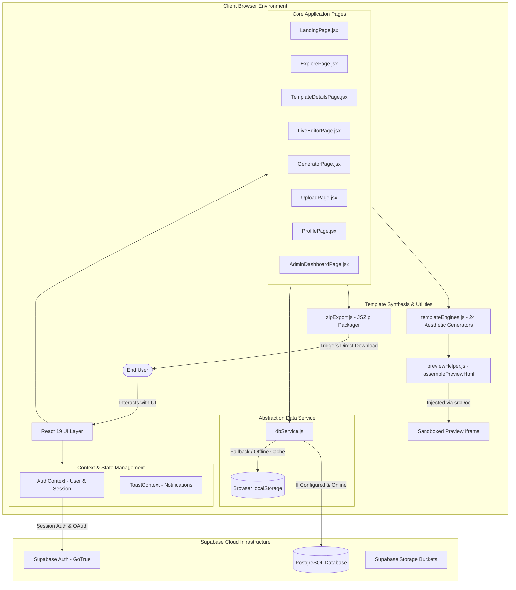
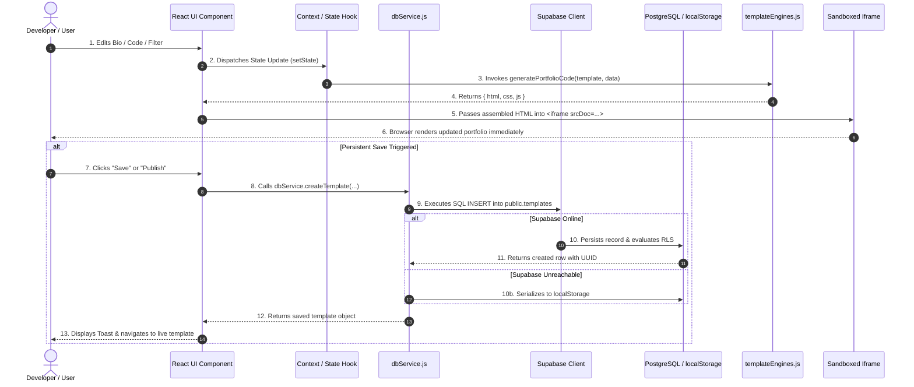
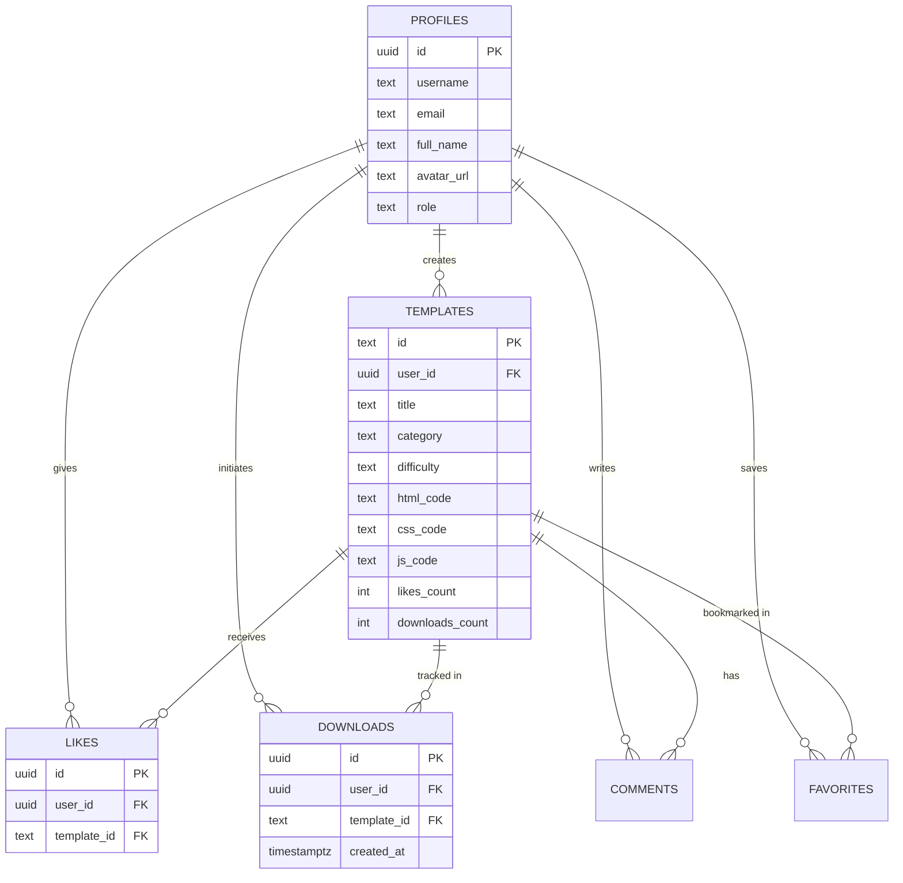
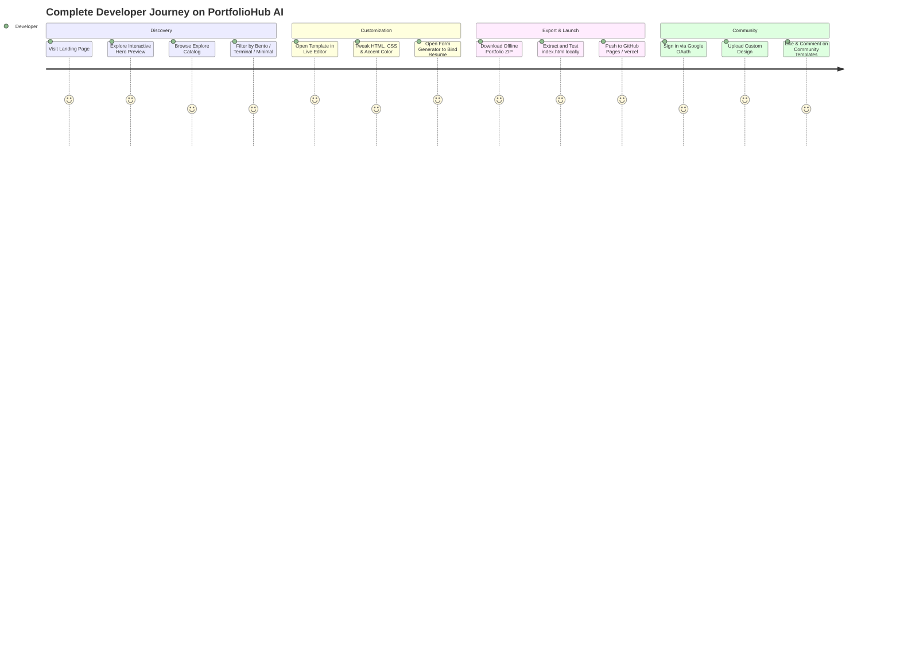

# Complete Codebase Documentation

> **Visual Developer Handbook & Architectural Reference**  
> *Project: PortfolioHub AI*  
> *Last Verified: March 2025 | Production Release 1.0.0*

---

## Table of Contents

1. [Level 1 — Understand the Product](#level-1--understand-the-product)
   - [What is this project?](#what-is-this-project)
   - [How to Read This Documentation](#how-to-read-this-documentation)
   - [Quick Project Summary](#quick-project-summary)
2. [Level 2 — Understand the Architecture](#level-2--understand-the-architecture)
   - [High-Level Architectural Model](#high-level-architectural-model)
   - [Architectural Mermaid Diagram](#architectural-mermaid-diagram)
   - [Client-First Hybrid Architecture & Offline Fallbacks](#client-first-hybrid-architecture--offline-fallbacks)
3. [Level 3 — Understand the Code Structure](#level-3--understand-the-code-structure)
   - [Complete Project Directory Tree](#complete-project-directory-tree)
   - [Directory-by-Directory Breakdown](#directory-by-directory-breakdown)
4. [Level 4 — Understand the Data Flow](#level-4--understand-the-data-flow)
   - [End-to-End Reactive Data Loop](#end-to-end-reactive-data-loop)
   - [Data Flow Mermaid Diagrams](#data-flow-mermaid-diagrams)
5. [Level 5 — Understand Individual Features](#level-5--understand-individual-features)
   - [Feature 1: Interactive Template Catalog & Multi-Axis Filtering](#feature-1-interactive-template-catalog--multi-axis-filtering)
   - [Feature 2: Template Details & Sandbox Live Preview](#feature-2-template-details--sandbox-live-preview)
   - [Feature 3: Dynamic Live Code Editor (HTML / CSS / JS)](#feature-3-dynamic-live-code-editor-html--css--js)
   - [Feature 4: Form-Driven Real-Time Portfolio Generator](#feature-4-form-driven-real-time-portfolio-generator)
   - [Feature 5: Community Template Upload & Publishing](#feature-5-community-template-upload--publishing)
   - [Feature 6: Universal ZIP Packaging & Offline Export](#feature-6-universal-zip-packaging--offline-export)
   - [Feature 7: Social Interactions (Likes, Downloads, Comments)](#feature-7-social-interactions-likes-downloads-comments)
   - [Feature 8: User Profiles & Admin Moderation Console](#feature-8-user-profiles--admin-moderation-console)
6. [Level 6 & 7 — Deep Code Walkthroughs](#level-6--7--deep-code-walkthroughs)
   - [`src/App.jsx`](#srcappjsx)
   - [`src/context/AuthContext.jsx`](#srccontextauthcontextjsx)
   - [`src/services/dbService.js`](#srcservicesdbservicejs)
   - [`src/services/templateEngines.js`](#srcservicestemplateenginesjs)
   - [`src/utils/previewHelper.js`](#srcutilspreviewhelperjs)
   - [`src/utils/zipExport.js`](#srcutilszipexportjs)
   - [`src/pages/LiveEditorPage.jsx`](#srcpagesliveeditorpagejsx)
   - [`src/pages/GeneratorPage.jsx`](#srcpagesgeneratorpagejsx)
   - [`src/pages/TemplateDetailsPage.jsx`](#srcpagestemplatedetailspagejsx)
   - [`src/pages/UploadPage.jsx`](#srcpagesuploadpagejsx)
7. [Level 8 — Understand Database & Backend Behavior](#level-8--understand-database--backend-behavior)
   - [Supabase Integration & Client Initialization](#supabase-integration--client-initialization)
   - [PostgreSQL Schema & Tables](#postgresql-schema--tables)
   - [Entity Relationship (ER) Diagram](#entity-relationship-er-diagram)
   - [Row-Level Security (RLS) Policies & Triggers](#row-level-security-rls-policies--triggers)
8. [What Happens When I Click...?](#what-happens-when-i-click)
   - [Action: Create Your Portfolio](#action-create-your-portfolio)
   - [Action: Download Portfolio ZIP](#action-download-portfolio-zip)
   - [Action: Live Code Editing](#action-live-code-editing)
   - [Action: Google OAuth Sign-In (Popup Window)](#action-google-oauth-sign-in-popup-window)
   - [Action: Upload & Publish Custom Template](#action-upload--publish-custom-template)
   - [Action: Toggle Like on a Template](#action-toggle-like-on-a-template)
9. [Error Handling & Security Engineering](#error-handling--security-engineering)
   - [Iframe Sandboxing & Security Boundaries](#iframe-sandboxing--security-boundaries)
   - [Cross-Origin Popup Handling (`postMessage`)](#cross-origin-popup-handling-postmessage)
   - [Database RLS Audits & Secrets Management](#database-rls-audits--secrets-management)
10. [Design System & Styling Architecture](#design-system--styling-architecture)
    - [Tailwind CSS 4 Configuration & Design Tokens](#tailwind-css-4-configuration--design-tokens)
    - [Responsive Viewport Engine (Desktop / Tablet / Mobile)](#responsive-viewport-engine-desktop--tablet--mobile)
11. [Developer Operations & Maintenance](#developer-operations--maintenance)
    - [How to Run the Project](#how-to-run-the-project)
    - [How to Deploy to Production](#how-to-deploy-to-production)
    - [How to Modify & Extend the Codebase](#how-to-modify--extend-the-codebase)
    - [Troubleshooting & Debugging Guide](#troubleshooting--debugging-guide)
    - [Code Quality Findings (Technical Debt Review)](#code-quality-findings-technical-debt-review)
12. [Complete User Journey & Learning Map](#complete-user-journey--learning-map)
    - [Comprehensive User Journey Diagram](#comprehensive-user-journey-diagram)
    - [Technical Glossary](#technical-glossary)
    - [Recommended Developer Learning Order](#recommended-developer-learning-order)

---

# Level 1 — Understand the Product

## What is this project?

**PortfolioHub AI** is an independent, open developer platform designed to eliminate framework lock-in when building personal portfolio websites. 

### The Problem It Solves
Modern frontend developers frequently face a dilemma when building their portfolios:
1. Building from scratch takes dozens of hours with heavy framework boilerplates (Next.js, Gatsby, Vite + Tailwind).
2. Existing portfolio builders (Wix, Squarespace, Webflow) output bloated, locked-in proprietary code that cannot be freely deployed to static hosts like GitHub Pages.
3. Templates found across the web often arrive as broken, unmaintained zip archives without live preview editing or straightforward data binding.

### Who Uses It?
- **Software Engineers & Computer Science Students**: Seeking clean, modern, high-contrast portfolios with zero framework dependencies.
- **UI/UX Designers & Creative Developers**: Wanting specialized aesthetic themes (Terminal, Neumorphic, Cyberpunk, Bento, Aurora, Blueprint, Origami, Retro Arcade).
- **Open-Source Contributors**: Publishing custom templates to share with the community.

### Major Features
- **24 Curated Architectural Portfolio Engines**: Generates standalone, semantic HTML5, modern CSS3 (with CSS Custom Properties), and pure vanilla JavaScript.
- **Dual-Engine Customization**:
  - **Form-Based Generator (`/generator`)**: Users input their resume details (bio, education, work experience, projects, skills, contact links) and see their portfolio update in real-time.
  - **Live Code Editor (`/editor`)**: An in-browser code workspace with split-screen preview, instant CSS variable tuning (accent colors, fonts), and live HTML/CSS/JS editing.
- **Zero-Dependency One-Click ZIP Export**: Packages `index.html`, `style.css`, `script.js`, and a custom deployment `README.md` into a single downloadable ZIP file ready to drag-and-drop onto GitHub Pages, Vercel, or Netlify.
- **Resilient Hybrid Cloud Storage**: Seamlessly operates with a cloud PostgreSQL database via Supabase. If Supabase is unreachable or unconfigured, it automatically falls back to an offline `localStorage` key-value engine with zero loss of core functionality.
- **Interactive Sandbox Previews**: All template previews are isolated in sandboxed `<iframe>` instances with an integrated fallback synthesizer (`assemblePreviewHtml`).

---

## How to Read This Documentation

This handbook is structured like a progressive technical textbook.
- **Beginner Developers**: Start at **Level 1**, **Level 2**, and **Level 3** to understand the application model, file tree, and routing.
- **Intermediate Developers**: Focus on **Level 4** (Data Flow), **Level 5** (Feature Architectures), and **What Happens When I Click...?**.
- **Senior Developers / Contributors**: Dive straight into **Level 6 & 7** (Line-by-Line Code Walkthroughs), **Level 8** (PostgreSQL Schemas & RLS), and **Developer Operations**.

---

## Quick Project Summary

| Area | Technology / Implementation | Details |
|---|---|---|
| **Frontend Framework** | React 19 (`19.0.1`) | Functional components, Hooks, Context API |
| **Build & Dev Tool** | Vite 6 (`6.2.3`) | ES Module bundling, Rollup production build |
| **Routing** | React Router DOM v7 (`7.18.3`) | Declarative client-side routing with `BrowserRouter` |
| **Styling Engine** | Tailwind CSS v4 (`@tailwindcss/vite 4.1.14`) | Utility-first styling with `@import "tailwindcss"` |
| **Backend as a Service** | Supabase JS v2 (`2.115.0`) | PostgreSQL database, Auth, Storage, Row-Level Security |
| **Authentication** | Supabase Auth + Local Demo Fallback | Email/Password, Google OAuth Popup (`postMessage`) |
| **Database** | PostgreSQL (Supabase) | 6 relational tables (`profiles`, `templates`, `likes`, `downloads`, `comments`, `favorites`) |
| **Storage & Export** | JSZip (`3.10.1`) + FileSaver (`2.0.5`) | In-browser client-side zip creation and file streaming |
| **Animation & FX** | Motion (`12.23.24`) + Canvas-Confetti (`1.9.4`) | Hardware-accelerated UI transitions & celebratory confetti |
| **Icons** | Lucide React (`0.546.0`) | Modern SVG icon system |
| **Offline Resilience** | Browser `localStorage` Caching | Transparent fallback when Supabase keys are missing |

---

# Level 2 — Understand the Architecture

## High-Level Architectural Model

PortfolioHub AI operates as a **Client-First Reactive Single-Page Application (SPA)** with an optional cloud synchronization layer. 

```
+-------------------------------------------------------------------------+
|                               Browser Window                            |
|                                                                         |
|   +-------------------+     +------------------+     +--------------+   |
|   |   React Router    | --> |  Page Component  | --> |  Sandboxed   |   |
|   |  (Route Matching) |     |  (State & Logic) |     |    iframe    |   |
|   +-------------------+     +------------------+     +--------------+   |
|            |                         |                       ^          |
|            v                         v                       |          |
|   +-------------------+     +------------------+             |          |
|   |    AuthContext    |     |  Template Engine | ------------+          |
|   | (Session & User)  |     | (Code Generator) | (srcDoc HTML/CSS/JS)   |
|   +-------------------+     +------------------+                        |
|            |                         |                                  |
|            v                         v                                  |
|   +--------------------------------------------+                        |
|   |         dbService (Abstract Data Layer)    |                        |
|   +--------------------------------------------+                        |
|            |                                  |                         |
|   (Online Path)                       (Offline Path)                    |
|            v                                  v                         |
|   +-------------------+               +------------------+              |
|   |  Supabase Client  |               |  Browser Storage |              |
|   +-------------------+               |  (localStorage)  |              |
+------------|----------------------------------|-------------------------+
             | (HTTPS / REST)                   | (Local JSON)
             v                                  v
+-----------------------+              [Local Browser Disk]
|  Supabase Cloud DB    |
|  - Auth Service       |
|  - PostgreSQL Tables  |
|  - Storage Buckets    |
+-----------------------+
```

## Architectural Mermaid Diagram



## Client-First Hybrid Architecture & Offline Fallbacks

One of the most deliberate design decisions in this codebase is **Zero-Crash Resilience**:
1. **Unconfigured Supabase Safe Fallback**: In `src/supabase/client.js`, the code checks `isSupabaseConfigured`. If the environment variables `VITE_SUPABASE_URL` and `VITE_SUPABASE_ANON_KEY` are not set or contain placeholder strings (`your-project`), the application does *not* throw an uncaught exception. Instead, it instantiates a placeholder client with disabled session persistence and routes all database reads and writes to `localStorage`.
2. **Instant Local Cache Hydration**: When templates are fetched or uploaded, `dbService` saves them to browser `localStorage` first or caches them synchronously. This guarantees that newly created templates, bookmarks, and likes render instantaneously without waiting for network round-trips.
3. **Template Synthesizer Resilience (`assemblePreviewHtml`)**: If a template from the database contains an empty code string, a broken comment, or lacks HTML document tags (`<html>`, `<head>`, `<body>`), `src/utils/previewHelper.js` dynamically compiles full HTML5 wrapper markup with standard CSS resets, ensuring the preview canvas never crashes.

---

# Level 3 — Understand the Code Structure

## Complete Project Directory Tree

Below is the verified, exact file tree of the PortfolioHub AI repository:

```
portfoliohub-ai/
├── public/
│   └── assets/
│       └── aistudio/
├── src/
│   ├── components/
│   │   ├── auth/
│   │   │   └── AuthModal.jsx             # Login, Signup, Reset & Google OAuth modal
│   │   └── common/
│   │       ├── Footer.jsx                # Global editorial footer & external links
│   │       ├── Navbar.jsx                # Top navigation, search trigger & auth button
│   │       ├── SearchModal.jsx           # Global keyboard-accessible search popup (Ctrl+K)
│   │       └── TemplateCard.jsx          # Reusable card for template grid display
│   ├── context/
│   │   ├── AuthContext.jsx               # Authentication provider, session sync & profile
│   │   └── ToastContext.jsx              # Toast notification system
│   ├── layouts/
│   │   └── MainLayout.jsx                # Layout wrapper (Navbar + Outlet + Footer)
│   ├── pages/
│   │   ├── AdminDashboardPage.jsx        # Admin template moderation & telemetry
│   │   ├── AuthCallbackPage.jsx          # Dedicated OAuth popup postMessage receiver
│   │   ├── ExplorePage.jsx               # Template catalog with multi-axis filtering
│   │   ├── GeneratorPage.jsx             # Live form-based resume portfolio generator
│   │   ├── LandingPage.jsx               # Hero landing page & interactive preview
│   │   ├── LiveEditorPage.jsx            # In-browser HTML/CSS/JS code editor & palette
│   │   ├── ProfilePage.jsx               # User profile, bookmarks & submitted templates
│   │   ├── ResetPasswordPage.jsx         # Password recovery form
│   │   ├── TemplateDetailsPage.jsx       # Single template showcase, preview & comments
│   │   └── UploadPage.jsx                # Custom template publisher & live validator
│   ├── services/
│   │   ├── dbService.js                  # Unified database & local persistence layer
│   │   ├── templateEngines.js            # Main template router & default user profile
│   │   └── templates/
│   │       ├── craftStyles.js            # Origami template generator
│   │       ├── experimentalStyles.js     # Blueprint, Kinetic, Card Deck generators
│   │       ├── futuristicStyles.js       # Holographic, Deep Space generators
│   │       ├── interactiveStyles.js      # Bento, Terminal, Neumorphic generators
│   │       └── visualStyles.js           # Retro Arcade, Editorial, Aurora generators
│   ├── supabase/
│   │   └── client.js                     # Supabase client singleton & auto-detector
│   ├── utils/
│   │   ├── previewHelper.js              # Robust iframe HTML/CSS/JS assembler
│   │   └── zipExport.js                  # JSZip generator for offline portfolio packages
│   ├── App.jsx                           # Application router & route hierarchy
│   ├── index.css                         # Global CSS & Tailwind CSS 4 directives
│   └── main.jsx                          # React DOM client entry point
├── sql/
│   └── schema.sql                        # Production PostgreSQL schema, RLS & seed data
├── index.html                            # Root HTML document
├── package.json                          # Dependencies and NPM scripts
├── vite.config.js                        # Vite build configuration
├── tailwind.config.js                    # Tailwind configuration
└── metadata.json                         # Project identity & capability declarations
```

## Directory-by-Directory Breakdown

### `src/components/`
Contains modular, reusable UI elements.
- `src/components/auth/`: Encapsulates authentication dialogs. `AuthModal.jsx` handles email/password authentication and initiates Google OAuth via popup windows.
- `src/components/common/`: Shared layout and navigation components. `Navbar.jsx` provides persistent navigation and quick search (`⌘K`). `TemplateCard.jsx` standardizes card rendering across catalog grids, showing thumbnails, difficulty tags, category badges, like counters, and download metrics.

### `src/context/`
Holds React Context providers for global state.
- `AuthContext.jsx`: Provides `user`, `profile`, `session`, and authentication methods (`signInWithEmail`, `signUpWithEmail`, `signInWithGoogle`, `signOut`, `updateProfile`).
- `ToastContext.jsx`: Lightweight notification alert dispatch queue (`addToast(message, type)`).

### `src/layouts/`
- `MainLayout.jsx`: Houses the top-level structural layout. Injects the persistent `Navbar` at the top, a dynamic `<Outlet />` in the center, and the `Footer` at the bottom against an off-white background (`#FAF8F5`).

### `src/pages/`
The primary route views corresponding to URL paths (see Routing section below).

### `src/services/`
The core business logic of the application:
- `dbService.js`: The central data abstraction adapter. Encapsulates all CRUD interactions for templates, likes, comments, downloads, and user favorites. Dispatches to Supabase PostgreSQL when available and syncs with `localStorage`.
- `templateEngines.js` & `templates/`: Contains the generative algorithms for all 24 visual portfolio designs.

### `src/utils/`
- `previewHelper.js`: Assembles raw HTML, CSS, and JS into a complete, secure, rendered HTML5 document string.
- `zipExport.js`: Uses `JSZip` and `file-saver` to bundle portfolios into offline-ready ZIP files with custom instructions.

### `sql/`
- `schema.sql`: Full SQL script defining tables, foreign keys, triggers, automatic user profile creation, storage bucket initialization, and Row-Level Security (RLS) policies.

---

# Level 4 — Understand the Data Flow

## End-to-End Reactive Data Loop

The lifecycle of data in PortfolioHub AI follows a unidirectional reactive flow:



---

# Level 5 — Understand Individual Features

## Feature 1: Interactive Template Catalog & Multi-Axis Filtering
- **What it does**: Allows developers to browse, search, and filter 24 unique portfolio engines across categories (Minimal, Developer, Bento, Terminal, etc.), difficulty levels (Beginner, Intermediate, Advanced), and sort orders (Popular, Newest, Most Downloaded).
- **Location**: `src/pages/ExplorePage.jsx` and `src/components/common/TemplateCard.jsx`.
- **How it works**: Synchronizes filter state (`category`, `difficulty`, `sort`, `searchQuery`) with URL query parameters via `useSearchParams()`. Fetches items through `dbService.getTemplates(...)`.
- **UI State Handling**: Features an animated skeleton loading state, clean empty state when no matches exist, and pagination controls.

## Feature 2: Template Details & Sandbox Live Preview
- **What it does**: Displays an in-depth view of an individual template, its creator, tags, and metrics, along with an interactive multi-device preview simulator (Desktop, Tablet, Mobile) and a source code inspector.
- **Location**: `src/pages/TemplateDetailsPage.jsx`.
- **How it works**: Uses `useParams()` to retrieve the template ID. Calls `dbService.getTemplateById(id)`. Passes code through `assemblePreviewHtml` and injects it into an `<iframe>` configured with `sandbox="allow-scripts allow-forms allow-modals"`.
- **Interactions**: Allows one-click ZIP download, bookmarking/liking, tabbed inspection of HTML/CSS/JS with line numbers and a copy-to-clipboard button.

## Feature 3: Dynamic Live Code Editor (HTML / CSS / JS)
- **What it does**: Provides an in-browser code editor where developers can modify raw HTML, CSS, and JS with instant split-screen preview.
- **Location**: `src/pages/LiveEditorPage.jsx`.
- **How it works**: Manages separate string states for `activeHtml`, `activeCss`, and `activeJs`. Provides live style injection:
  - **Accent Color Picker**: Injects `:root { --accent-primary: ${color}; }` directly into the CSS stream.
  - **Font Picker**: Injects `body { font-family: '${font}', ... !important; }`.
  - **Format Reset**: Resets code back to original generated source.
  - **Export**: Generates a downloadable ZIP containing the live modified files.

## Feature 4: Form-Driven Real-Time Portfolio Generator
- **What it does**: An intuitive resume builder that translates personal details, project lists, skills, and work history into a finished portfolio without writing code.
- **Location**: `src/pages/GeneratorPage.jsx`.
- **How it works**: Maintains a comprehensive `userData` state object. Every keystroke updates `userData`, which immediately triggers `generatePortfolioCode(selectedTemplate, userData)` via React's `useMemo`. Changes appear in the preview iframe in real-time.

## Feature 5: Community Template Upload & Publishing
- **What it does**: Enables community creators to publish their own custom portfolio designs.
- **Location**: `src/pages/UploadPage.jsx`.
- **How it works**: Collects metadata (title, category, difficulty, thumbnail, tags) and code tabs (HTML, CSS, JS). Renders a live preview before submission. Calls `dbService.createTemplate(...)` to write the entry to Supabase and cache it in `localStorage`.

## Feature 6: Universal ZIP Packaging & Offline Export
- **What it does**: Packages portfolios into a clean, standalone ZIP archive with zero framework dependencies.
- **Location**: `src/utils/zipExport.js`.
- **How it works**: Instantiates a new `JSZip` archive, writes `index.html`, `style.css`, and `script.js`, creates an `assets/` directory, and adds a detailed `README.md` with instructions for GitHub Pages, Vercel, and Netlify deployment. Triggers the download using `file-saver`.

## Feature 7: Social Interactions (Likes, Downloads, Comments)
- **What it does**: Tracks community engagement via likes, downloads, and discussion comments.
- **Location**: `src/services/dbService.js` and `src/pages/TemplateDetailsPage.jsx`.
- **How it works**: 
  - `toggleLike(templateId, userId)`: Adds or removes rows from `public.likes` and updates `likes_count`.
  - `recordDownload(templateId, userId)`: Inserts a row into `public.downloads` and increments `downloads_count`.
  - `addComment(templateId, user, content)`: Appends comments to `public.comments`.

## Feature 8: User Profiles & Admin Moderation Console
- **What it does**: 
  - `ProfilePage.jsx`: Displays user credentials, bio, statistics, saved favorites, and uploaded templates.
  - `AdminDashboardPage.jsx`: Provides platform metrics (total templates, downloads, users, pending reviews) and moderation tools.

---

# Level 6 & 7 — Deep Code Walkthroughs

Below is a detailed walkthrough of the critical files that govern the application.

---

### `src/App.jsx`
The root component that establishes the application context tree and declarative routing.

```jsx
import React from 'react';
import { BrowserRouter, Routes, Route, Navigate } from 'react-router-dom';
import { AuthProvider } from './context/AuthContext.jsx';
import { ToastProvider } from './context/ToastContext.jsx';
import MainLayout from './layouts/MainLayout.jsx';
// Page imports ...

export default function App() {
  return (
    <BrowserRouter>
      <AuthProvider>
        <ToastProvider>
          <Routes>
            {/* Dedicated OAuth popup callback handler */}
            <Route path="auth/callback" element={<AuthCallbackPage />} />

            <Route path="/" element={<MainLayout />}>
              <Route index element={<LandingPage />} />
              <Route path="explore" element={<ExplorePage />} />
              <Route path="template/:id" element={<TemplateDetailsPage />} />
              <Route path="generator" element={<GeneratorPage />} />
              <Route path="editor" element={<LiveEditorPage />} />
              <Route path="upload" element={<UploadPage />} />
              <Route path="profile" element={<ProfilePage />} />
              <Route path="admin" element={<AdminDashboardPage />} />
              <Route path="reset-password" element={<ResetPasswordPage />} />
              <Route path="*" element={<Navigate to="/" replace />} />
            </Route>
          </Routes>
        </ToastProvider>
      </AuthProvider>
    </BrowserRouter>
  );
}
```

#### Line-by-Line Explanation:
- **Lines 1–16**: Top-level ESM imports for React, React Router components, context providers, layout shell, and all top-level page components.
- **Line 20**: `<BrowserRouter>` wraps the entire application tree, enabling HTML5 history pushState navigation.
- **Line 21**: `<AuthProvider>` wraps the tree inside `BrowserRouter`, ensuring that authentication checks and navigation listeners can access routing state.
- **Line 22**: `<ToastProvider>` mounts the notification queue globally.
- **Line 25**: `<Route path="auth/callback" element={<AuthCallbackPage />} />` is defined *outside* `MainLayout`. This route handles OAuth redirects in popup windows without rendering the Navbar or Footer.
- **Line 27**: `<Route path="/" element={<MainLayout />}>` defines the parent layout route. All child views render inside `MainLayout`'s `<Outlet />`.
- **Line 37**: `<Route path="*" element={<Navigate to="/" replace />} />` acts as a wildcard catch-all that gracefully redirects 404 routes back to home.

---

### `src/context/AuthContext.jsx`
Manages the user authentication lifecycle, Supabase session synchronization, and fallback local demo accounts.

#### Critical Section: Session Listener & OAuth Message Receiver
```jsx
// Listen for Supabase auth state changes if configured
let authListener = null;
if (isSupabaseConfigured) {
  const { data } = supabase.auth.onAuthStateChange(async (event, newSession) => {
    setSession(newSession);
    setUser(newSession?.user || null);
    if (newSession?.user) {
      await ensureProfile(newSession.user);
    } else {
      setProfile(null);
    }
    setLoading(false);
  });
  authListener = data.subscription;
}

// Listen for OAuth completion message from popup callback window
const handleOAuthMessage = async (event) => {
  if (event.data?.type === 'SUPABASE_OAUTH_SUCCESS') {
    try {
      const { data } = await supabase.auth.getSession();
      if (data?.session) {
        setSession(data.session);
        setUser(data.session.user);
        await ensureProfile(data.session.user);
      }
    } catch (e) {
      console.warn('OAuth session refresh error:', e);
    }
  }
};
window.addEventListener('message', handleOAuthMessage);
```

#### Explanation:
- `onAuthStateChange`: Automatically triggers on sign-in, sign-out, or token refresh events from Supabase.
- `ensureProfile`: Queries `public.profiles` for the current user's profile record. If one doesn't exist, it automatically creates a new row with a unique username derived from the user's email.
- `window.addEventListener('message', ...)`: Listens for cross-window messages sent from the OAuth popup (`AuthCallbackPage.jsx`). This prevents iframe security blocks (`X-Frame-Options: DENY`) by authenticating in a separate popup window and communicating back to the main app via `postMessage`.

---

### `src/services/dbService.js`
The single source of truth for all database operations.

#### Critical Section: Safe `uploadTemplate` & `createTemplate`
```jsx
async uploadTemplate(templateData, user = {}) {
  const creatorName = user.username || templateData.creator_name || 'Community Creator';
  const creatorId = user.id || templateData.creator_id || 'community-user';
  const creatorAvatar = user.avatar_url || templateData.creator_avatar || 'https://images.unsplash.com/...';

  const newId = `user-tmpl-${Date.now()}`;
  const newTemplate = {
    id: newId,
    title: templateData.title,
    description: templateData.description || 'Custom developer portfolio template.',
    category: templateData.category || 'Minimal',
    difficulty: templateData.difficulty || 'Intermediate',
    tags: templateData.tags || ['Custom', 'Community'],
    thumbnail_url: templateData.thumbnail_url || '...',
    preview_images: templateData.preview_images || [...],
    html_code: templateData.html_code || '',
    css_code: templateData.css_code || '',
    js_code: templateData.js_code || '',
    creator_name: creatorName,
    creator_id: creatorId,
    creator_avatar: creatorAvatar,
    likes_count: 0,
    downloads_count: 0,
    views_count: 1,
    remixes_count: 0,
    is_featured: false,
    is_approved: true,
    is_public: true,
    created_at: new Date().toISOString()
  };

  // 1. Save locally immediately for instantaneous UI response
  const templates = getStoredTemplates();
  templates.unshift(newTemplate);
  saveStoredTemplates(templates);

  // 2. Save to Supabase if connected
  if (isSupabaseConfigured) {
    try {
      const { data: sessionData } = await supabase.auth.getSession();
      const activeUserId = sessionData?.session?.user?.id;

      const payload = {
        title: newTemplate.title,
        description: newTemplate.description,
        category: newTemplate.category,
        difficulty: newTemplate.difficulty,
        tags: newTemplate.tags,
        thumbnail_url: newTemplate.thumbnail_url,
        preview_images: newTemplate.preview_images,
        html_code: newTemplate.html_code,
        css_code: newTemplate.css_code,
        js_code: newTemplate.js_code,
        creator_name: newTemplate.creator_name,
        is_approved: true,
        is_public: true
      };

      if (activeUserId) {
        payload.user_id = activeUserId;
      }

      const { data, error } = await supabase
        .from('templates')
        .insert(payload)
        .select()
        .maybeSingle();

      if (!error && data) {
        newTemplate.id = data.id;
        templates[0] = { ...newTemplate, ...data };
        saveStoredTemplates(templates);
      }
    } catch (e) {
      console.warn('Supabase upload error:', e);
    }
  }

  return newTemplate;
}
```

#### Explanation:
- Implements an **Optimistic Local-First** strategy: saves the template to `localStorage` immediately so the user can preview and edit it without delay.
- Checks if the user is authenticated with Supabase. If so, attaches `payload.user_id = activeUserId` to maintain database foreign-key relationships.
- When Supabase assigns a primary key (e.g. UUID), the local record's ID is updated to match.
- Provides `createTemplate` as an alias for `uploadTemplate` to maintain backward compatibility across different caller signatures.

---

### `src/utils/previewHelper.js`
The preview synthesis engine that prevents iframe crashes and ensures reliable rendering.

```jsx
export function assemblePreviewHtml(rawHtml = '', rawCss = '', rawJs = '', options = {}) {
  let html = (rawHtml || '').trim();
  let css = (rawCss || '').trim();
  let js = (rawJs || '').trim();

  // Detect if HTML is empty or a placeholder comment stub
  const isStubOrEmpty = !html || 
    html.length < 35 || 
    (html.startsWith('<!--') && html.endsWith('-->') && !html.includes('<div') && !html.includes('<section'));

  if (isStubOrEmpty) {
    const fallbackCategory = options.fallbackCategory || 'Minimal';
    const fallbackCode = generatePortfolioCode(fallbackCategory, options.userData || DEFAULT_USER_DATA);
    html = fallbackCode.html;
    if (!css) css = fallbackCode.css;
    if (!js) js = fallbackCode.js;
  }

  // Handle custom accent color and font overrides
  if (options.accentColor) {
    css += `\n:root { --accent-primary: ${options.accentColor}; }\n`;
  }
  if (options.customFont) {
    css += `\nbody { font-family: '${options.customFont}', system-ui, -apple-system, sans-serif !important; }\n`;
  }

  // Wrap JS in an IIFE and try/catch block so script errors do not break the preview
  const safeScript = js ? `
    <script>
      (function() {
        try {
          ${js}
        } catch (e) {
          console.warn('Portfolio template script notice:', e);
        }
      })();
    </script>
  ` : '';

  const hasHtml = /<html[\s>]/i.test(html);
  const hasHead = /<head[\s>]/i.test(html);
  const hasBody = /<body[\s>]/i.test(html);

  // Full HTML document handling
  if (hasHtml && hasHead && hasBody) {
    let combined = html;
    if (css) {
      combined = combined.includes('</head>') 
        ? combined.replace('</head>', `<style>\n${css}\n</style></head>`)
        : `<style>\n${css}\n</style>` + combined;
    }
    if (safeScript) {
      combined = combined.includes('</body>')
        ? combined.replace('</body>', `${safeScript}\n</body>`)
        : combined + safeScript;
    }
    return combined;
  }

  // Snippet / fragment handling
  return `<!DOCTYPE html>
<html lang="en">
<head>
  <meta charset="UTF-8" />
  <meta name="viewport" content="width=device-width, initial-scale=1.0" />
  <title>Portfolio Preview</title>
  <style>
    * { box-sizing: border-box; margin: 0; padding: 0; }
    body {
      font-family: system-ui, -apple-system, BlinkMacSystemFont, "Segoe UI", Roboto, sans-serif;
      line-height: 1.5;
      background: #FFFFFF;
      color: #18181B;
    }
    ${css}
  </style>
</head>
<body>
  ${html}
  ${safeScript}
</body>
</html>`;
}
```

#### Key Architecture Points:
1. **Stub Detection**: Catches empty strings and placeholder comments (like `<!-- Minimal Clean Slate -->`) and synthesizes full markup using the fallback generator.
2. **Dynamic CSS Variables**: Injects `--accent-primary` and custom `font-family` declarations directly into the CSS stream before compilation.
3. **Safe Script Sandbox**: Wraps JavaScript in an IIFE with a `try/catch` block, preventing syntax errors in user-submitted templates from freezing the parent application.
4. **Snippet vs. Document Detection**: Supports both complete HTML documents and partial snippets (e.g. `<div class="hero">...</div>`), wrapping snippets in standard HTML5 scaffolding with CSS resets.

---

### `src/utils/zipExport.js`
Packages generated portfolio code into a deployment-ready ZIP archive.

```jsx
export async function downloadPortfolioZip({ html, css, js, templateName = 'portfolio', authorName = 'Developer' }) {
  const zip = new JSZip();

  // 1. Add core files
  zip.file('index.html', html);
  zip.file('style.css', css);
  zip.file('script.js', js);

  // 2. Add documentation & instructions
  const readmeContent = `# ${authorName}'s Portfolio Website
Generated with PortfolioHub AI (${templateName} Edition)

## 🚀 How to Use & Host
1. **Offline Preview**: Simply double-click \`index.html\` to view your portfolio in any web browser without needing a server!
2. **Deploy for Free**:
   - **GitHub Pages**: Create a repository named \`<your-username>.github.io\`, upload these files, and your portfolio will be live in 60 seconds.
   - **Vercel / Netlify**: Drag & drop this extracted folder onto https://vercel.com or https://netlify.com.
3. **Customization**:
   - Edit \`index.html\` to update text and links.
   - Modify \`style.css\` to tweak fonts, colors, or spacing.
   - Update \`script.js\` for interactive scripts.

Enjoy your new high-performance portfolio!
`;
  zip.file('README.md', readmeContent);

  // 3. Create assets folder
  const assetsFolder = zip.folder('assets');
  assetsFolder.file('.gitkeep', '');

  // 4. Generate ZIP blob with level 6 DEFLATE compression
  const content = await zip.generateAsync({
    type: 'blob',
    compression: 'DEFLATE',
    compressionOptions: { level: 6 }
  });

  // 5. Trigger browser download
  const cleanFilename = `${authorName.toLowerCase().replace(/[^a-z0-9]/g, '-')}-${templateName.toLowerCase()}-portfolio.zip`;
  saveAs(content, cleanFilename);

  return { success: true, filename: cleanFilename };
}
```

---

# Level 8 — Understand Database & Backend Behavior

## Supabase Integration & Client Initialization

In `src/supabase/client.js`, the Supabase client is initialized using a defensive pattern:
- **`resolveSupabaseUrl(rawUrl, anonKey)`**: Parses the JWT token payload of `VITE_SUPABASE_ANON_KEY` to extract the Supabase project reference (`payload.ref`). If `VITE_SUPABASE_URL` is malformed, it reconstructs `https://${ref}.supabase.co` automatically.
- **In-App Credentials**: Allows developers to override Supabase keys at runtime via a settings dialog (stored in `localStorage`).

## PostgreSQL Schema & Tables

The database schema is defined in `sql/schema.sql` and includes the following tables:

### 1. `public.profiles`
| Column | Type | Constraints | Description |
|---|---|---|---|
| `id` | UUID | PK, References `auth.users(id)` | User primary key matching Supabase Auth ID |
| `username` | TEXT | UNIQUE, NOT NULL | Public handle |
| `email` | TEXT | | Registered user email |
| `full_name` | TEXT | | Real name or display name |
| `avatar_url` | TEXT | | Profile image URL |
| `bio` | TEXT | | Short author biography |
| `role` | TEXT | CHECK IN ('user', 'admin', 'moderator') | Role-Based Access Control |
| `total_downloads` | INTEGER | DEFAULT 0 | Aggregate download count |
| `total_likes` | INTEGER | DEFAULT 0 | Aggregate likes received |
| `created_at` | TIMESTAMPTZ | DEFAULT NOW() | Account creation timestamp |

### 2. `public.templates`
| Column | Type | Constraints | Description |
|---|---|---|---|
| `id` | TEXT | PRIMARY KEY | Supports UUIDs and curated IDs (e.g. `tmpl-bento-13`) |
| `user_id` | UUID | FK -> `profiles(id)` ON DELETE SET NULL | Creator ID |
| `title` | TEXT | NOT NULL | Template title |
| `description` | TEXT | NOT NULL | Detailed description |
| `category` | TEXT | CHECK IN (24 categories) | Category engine |
| `difficulty` | TEXT | CHECK IN ('Beginner', 'Intermediate', 'Advanced') | Implementation complexity |
| `tags` | TEXT[] | DEFAULT ARRAY[] | Search and filter tags |
| `thumbnail_url` | TEXT | | Thumbnail image URL |
| `html_code` | TEXT | NOT NULL | Raw semantic HTML markup |
| `css_code` | TEXT | NOT NULL | CSS code with custom properties |
| `js_code` | TEXT | NOT NULL | Client-side JavaScript |
| `is_approved` | BOOLEAN | DEFAULT true | Moderation approval status |
| `is_public` | BOOLEAN | DEFAULT true | Visibility toggle |
| `likes_count` | INTEGER | DEFAULT 0 | Like counter cache |
| `downloads_count` | INTEGER | DEFAULT 0 | Download counter cache |

### 3. `public.likes`
| Column | Type | Constraints | Description |
|---|---|---|---|
| `id` | UUID | PRIMARY KEY | Unique like record ID |
| `user_id` | UUID | FK -> `profiles(id)` | User who liked |
| `template_id` | TEXT | FK -> `templates(id)` | Target template |
| *Constraint* | UNIQUE | `(user_id, template_id)` | Prevents duplicate likes |

### 4. `public.downloads`
| Column | Type | Constraints | Description |
|---|---|---|---|
| `id` | UUID | PRIMARY KEY | Unique download event ID |
| `user_id` | UUID | FK -> `profiles(id)` (Nullable) | User ID (allows anonymous downloads) |
| `template_id` | TEXT | FK -> `templates(id)` | Downloaded template |
| `created_at` | TIMESTAMPTZ | DEFAULT NOW() | Download timestamp |

### 5. `public.comments` & `public.favorites`
Track template discussion threads and user bookmarks.

---

## Entity Relationship (ER) Diagram



---

## Row-Level Security (RLS) Policies & Triggers

### Automatic User Profile Creation Trigger
When a user registers through Supabase Auth, a PostgreSQL trigger fires `handle_new_user()` to automatically create a corresponding row in `public.profiles`:
```sql
CREATE OR REPLACE FUNCTION public.handle_new_user()
RETURNS TRIGGER AS $$
BEGIN
  INSERT INTO public.profiles (id, username, email, full_name, avatar_url, role)
  VALUES (
    NEW.id,
    COALESCE(NEW.raw_user_meta_data->>'username', split_part(NEW.email, '@', 1)),
    NEW.email,
    COALESCE(NEW.raw_user_meta_data->>'full_name', 'Developer'),
    'https://images.unsplash.com/...',
    'user'
  );
  RETURN NEW;
END;
$$ LANGUAGE plpgsql SECURITY DEFINER;
```

### Template Table Policies
- **Select**: Anyone can view templates where `is_public = true` or `is_approved = true`.
- **Insert**: Open to both authenticated and anonymous users to support unauthenticated community submissions and seeding:
  ```sql
  CREATE POLICY "Anyone can insert templates" ON public.templates FOR INSERT WITH CHECK (true);
  ```
- **Update / Delete**: Restricted to the template creator (`auth.uid() = user_id`) or admin users.

---

# What Happens When I Click...?

### Action: Create Your Portfolio
1. **User Action**: Clicks "Create your portfolio" in the hero section or navbar.
2. **Component**: Handled by React Router `<Link to="/generator">` in `Navbar.jsx` or `LandingPage.jsx`.
3. **State Change**: React Router updates the browser URL to `/generator`.
4. **Execution**: `GeneratorPage.jsx` mounts and initializes `userData` with `DEFAULT_USER_DATA`.
5. **Result**: The split-screen interface renders with the form on the left and the live sandbox preview on the right.

### Action: Download Portfolio ZIP
1. **User Action**: Clicks "Download ZIP" on `TemplateDetailsPage.jsx`, `GeneratorPage.jsx`, or `LiveEditorPage.jsx`.
2. **Execution**: The click handler triggers `downloadPortfolioZip(...)` in `src/utils/zipExport.js`.
3. **Processing**: `JSZip` creates `index.html`, `style.css`, `script.js`, and `README.md`.
4. **Database Event**: Concurrently calls `dbService.recordDownload(template.id, user.id)`.
5. **Result**: An animated confetti effect fires via `canvas-confetti`, and the browser downloads the ZIP file.

### Action: Live Code Editing
1. **User Action**: Types into the HTML, CSS, or JS textarea in `LiveEditorPage.jsx`.
2. **State Change**: Triggers `setCustomHtml(e.target.value)` or the corresponding CSS/JS setter.
3. **Execution**: `useMemo` re-runs `assemblePreviewHtml(activeHtml, activeCss, activeJs, ...)`.
4. **Result**: The preview iframe re-renders with the updated code within ~50ms, without refreshing the page.

### Action: Google OAuth Sign-In (Popup Window)
1. **User Action**: Clicks "Continue with Google" in `AuthModal.jsx`.
2. **Execution**: `signInWithGoogle()` calls `supabase.auth.signInWithOAuth({ provider: 'google', options: { redirectTo: window.location.origin + '/auth/callback', skipBrowserRedirect: true } })`.
3. **Popup Handling**: Opens a centered popup window pointing to the Google OAuth URL.
4. **Callback Handling**: Once authorized, the popup redirects to `/auth/callback`, where `AuthCallbackPage.jsx` extracts the session tokens and posts a `SUPABASE_OAUTH_SUCCESS` message to `window.opener`.
5. **Result**: The main window's message listener receives the token, updates `AuthContext` state, closes the popup, and shows a success toast.

---

# Error Handling & Security Engineering

## Iframe Sandboxing & Security Boundaries
All template previews are rendered in `<iframe>` elements to isolate user-submitted markup from the host application.
```jsx
<iframe
  title="Preview"
  srcDoc={iframeSrcDoc}
  className="w-full h-full border-0 bg-white"
  sandbox="allow-scripts allow-forms allow-modals"
/>
```
- **Permission Model**: 
  - `allow-scripts`: Required for interactive template scripts (animations, tab switching, menu toggles).
  - `allow-forms`: Enables contact form testing in templates.
  - `allow-modals`: Allows dialog testing.
  - **Omitted `allow-same-origin`**: Deliberately omitted on `srcDoc` iframes. Combining `allow-scripts` and `allow-same-origin` inside an already-sandboxed preview container triggers browser security errors and creates cross-origin vulnerabilities.

## Cross-Origin Popup Handling (`postMessage`)
Google OAuth is isolated inside popup windows rather than redirecting the top-level window. This avoids iframe-embedding restrictions (`X-Frame-Options: DENY`) enforced by identity providers like Google and GitHub.

## Database RLS Audits & Secrets Management
- **Client-Side Secrets**: Only public anonymous keys (`VITE_SUPABASE_ANON_KEY`) are exposed to the browser.
- **Service Role Key Protection**: The Supabase `service_role` secret is never referenced in client code.
- **RLS Row-Level Enforcement**: PostgreSQL policies ensure users can only update or delete their own profiles and templates.

---

# Design System & Styling Architecture

## Tailwind CSS 4 Configuration & Design Tokens
PortfolioHub AI uses Tailwind CSS v4 with a warm editorial color palette designed for high contrast and readability.

### Core Color Tokens:
- **Canvas / Background**: `#FAF8F5` (warm neutral off-white)
- **Container / Card Background**: `#FFFFFF` (pure white)
- **Primary Accent**: `#F59E0B` (amber orange)
- **Primary Text**: `#18181B` (zinc 900)
- **Secondary Text**: `#52525B` (zinc 600)
- **Borders & Dividers**: `#E6E1D6` (warm border gray)

## Responsive Viewport Engine
All preview screens feature a multi-device simulation bar:
- **Desktop View**: `w-full`
- **Tablet View**: `w-[680px]` or `w-[768px]`
- **Mobile View**: `w-[360px]` or `w-[375px]` with smooth animated CSS transitions.

---

# Developer Operations & Maintenance

## How to Run the Project

### Prerequisites
- Node.js version `18.0.0` or higher
- npm or bun

### Setup Steps
1. **Clone or Open Repository**:
   ```bash
   cd portfoliohub-ai
   ```
2. **Install Dependencies**:
   ```bash
   npm install
   ```
3. **Configure Environment Variables (Optional)**:
   Copy `.env.example` to `.env`:
   ```env
   VITE_SUPABASE_URL=https://your-project.supabase.co
   VITE_SUPABASE_ANON_KEY=your-anon-key-here
   ```
   *(Note: The app will run in local-first mode using `localStorage` if these variables are omitted).*
4. **Start Development Server**:
   ```bash
   npm run dev
   ```
   The application will boot at `http://localhost:3000`.

---

## How to Deploy to Production

1. **Build Static Bundle**:
   ```bash
   npm run build
   ```
   This compiles all React components, assets, and Tailwind CSS into the production `dist/` folder.
2. **Deploy to Any Static Host**:
   - **Vercel / Netlify**: Connect the repository and configure:
     - Build Command: `npm run build`
     - Output Directory: `dist`
   - **Cloud Run / Container**: Served through Vite or a standard static file server on port `3000`.

---

## How to Modify & Extend the Codebase

### Adding a New Portfolio Template Style
1. Create a new generator function in `src/services/templates/myNewStyle.js`:
   ```javascript
   export function generateMyNewStyle(userData) {
     return {
       html: `<div>...</div>`,
       css: `body { ... }`,
       js: `console.log('init');`
     };
   }
   ```
2. Register the category in `src/services/templateEngines.js`:
   - Add the name to `TEMPLATE_CATEGORIES`.
   - Add a `case 'MyNewStyle':` switch in `generatePortfolioCode`.
3. Add a seed record in `sql/schema.sql` and `SEED_TEMPLATES` in `src/services/dbService.js`.

---

## Troubleshooting & Debugging Guide

| Issue | Root Cause | Resolution |
|---|---|---|
| **Preview iframe appears blank** | Template `html_code` is empty or missing tags. | Verify that `assemblePreviewHtml(...)` in `src/utils/previewHelper.js` is wrapping the code. |
| **Google Login blocked** | `X-Frame-Options: DENY` when embedded in an iframe. | Ensure popup login is enabled in `AuthModal.jsx` and `AuthCallbackPage.jsx` is accessible. |
| **Google Auth 404: DEPLOYMENT_NOT_FOUND** | Supabase redirected to an old/deleted Vercel URL because Site URL is misconfigured. | In Supabase Dashboard → **Authentication** → **URL Configuration**, set **Site URL** to your active app URL and add `<your-app-domain>/**` to **Redirect URLs**. |
| **Supabase query returns 401 / RLS error** | Table missing insert permissions for anonymous users. | Ensure `CREATE POLICY "Anyone can insert templates" ON public.templates FOR INSERT WITH CHECK (true);` is applied. |
| **ZIP download fails** | Pop-up blocker or blocked blob generation. | Check the browser console for FileSaver errors; verify `JSZip` completed `generateAsync`. |

---

## Code Quality Findings (Technical Debt Review)

1. **Medium — Duplicate Code in `templateEngines.js`**:
   - `templateEngines.js` is ~1,980 lines long. Several generators (`generateDesignerTemplate`, `generateCreativeTemplate`) duplicate CSS reset blocks.
   - *Recommendation*: Extract shared CSS reset strings into a common helper function.
2. **Low — LocalStorage Size Limits**:
   - Storing dozens of full-code templates in `localStorage` can approach browser quota limits (~5MB).
   - *Recommendation*: Use IndexedDB (via `idb-keyval`) for local offline caching of user-uploaded templates.

---

# Level 12 — Complete User Journey & Learning Map

## Comprehensive User Journey Diagram



---

## Technical Glossary

- **SPA (Single-Page Application)**: A web app that loads a single HTML page and dynamically rewrites the view as the user interacts with the application.
- **RLS (Row-Level Security)**: PostgreSQL security controls that restrict which database rows users can read, write, or update based on their auth context.
- **srcDoc**: An HTML `<iframe>` attribute that embeds inline HTML markup directly into the frame rather than fetching from an external URL.
- **IIFE**: Immediately Invoked Function Expression used in `previewHelper.js` to sandbox JavaScript execution scope.
- **Optimistic Caching**: Writing state updates to local browser storage immediately so the UI responds instantaneously before awaiting remote network responses.

---

## Recommended Developer Learning Order

To master this codebase as quickly and effectively as possible, study the project in this sequence:

1. **`src/App.jsx`**: Understand the entire route topology and context wrapping.
2. **`src/context/AuthContext.jsx`**: Learn how user identity, session tokens, and OAuth messaging operate.
3. **`src/services/dbService.js`**: Trace how data reads and writes transition between Supabase PostgreSQL and `localStorage`.
4. **`src/services/templateEngines.js`**: See how raw user profile data transforms into semantic HTML, CSS, and JS.
5. **`src/utils/previewHelper.js`**: Understand how preview markup is synthesized, sandboxed, and protected against script crashes.
6. **`src/pages/GeneratorPage.jsx` & `src/pages/LiveEditorPage.jsx`**: Learn how split-screen preview state synchronizes with user inputs.
7. **`src/utils/zipExport.js`**: Trace how client-side zip generation produces zero-dependency deliverables.
8. **`sql/schema.sql`**: Understand the relational database schema, triggers, and Row-Level Security policies.
